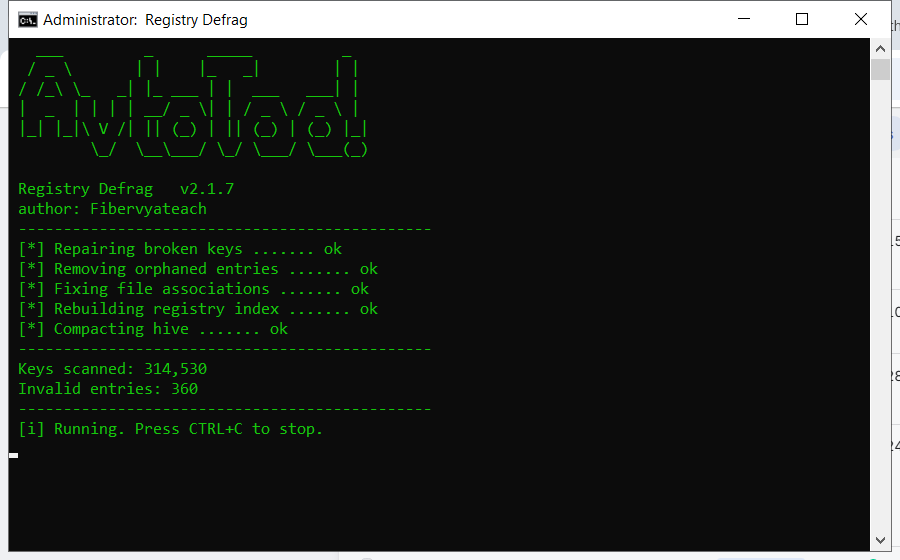

# Registry Defrag — Free Download [2026]

 

**Registry defrag** scans your PC and removes the junk that slows it down - temporary files, broken entries and leftover data. Everything stays on your own computer. **No telemetry, no cloud, no account.**

| | |
| --- | --- |
| **Program** | Registry Defrag |
| **Version** | Latest 2026 build |
| **Price** | Free |
| **Systems** | see requirements below |
| **Download** | Quick Start section below |

  

## Before You Start

- Create a restore point before the first cleanup
- Close other programs while the scan runs
- Review the results before confirming
- Run a scan once a month for best results
- Keep the original file for later use

## Requirements

| **Component** | **Requirement** |
| --- | --- |
| **Operating system** | Windows 10 or 11 (64-bit) |
| **RAM** | 2 GB or more |
| **Free disk space** | 100 MB |
| **Permissions** | Administrator (for some tasks) |

## Install

1. **Download** the tool from this page
2. **Close** your other programs
3. **Launch** it and let it load
4. **Scan** your system
5. **Clean** the results, then reboot

  

> **Note:** if nothing happens when you click, run the file as administrator. Windows sometimes blocks new programs until you allow them.

## What It Does

In short: registry defrag cleans up your PC and fixes small problems that build up over time. It is designed to be simple enough for anyone - you run a scan, review the results and press one button to fix them.

| **Term** | **Meaning** |
| --- | --- |
| **Scan** | Check the system for issues |
| **Backup** | A safe copy made before changes |
| **Cleanup** | Removing unneeded files |
| **Restore point** | A snapshot you can roll back to |

## Features

| **Feature** | **Details** |
| --- | --- |
| **Startup manager** | Turn off unneeded startup apps |
| **Disk tools** | Clean, analyse, defragment |
| **Registry** | Scan and repair entries |
| **Privacy** | Clear usage traces |
| **Scheduler** | Automatic weekly scans |
| **Log** | Keeps a record of changes |

## Problems and Fixes

| **Issue** | **Fix** |
| --- | --- |
| **High CPU during scan** | Expected - it throttles when you use the PC |
| **Antivirus blocks cleanup** | Add an exclusion for the tool |
| **Cleanup leaves temp files** | Some are locked - reboot and rescan |
| **Tool asks for admin** | Approve it so it can clean system areas |

## FAQ

**Is admin access required?**

For a full cleanup, yes. Without it the tool only cleans your user folders.

**Will it fix my registry?**

It can scan and repair broken entries, and it backs up before changing anything.

**Does it work offline?**

Yes - once downloaded it needs no internet connection.

**How much space will I save?**

It varies, but most PCs recover several gigabytes on the first run.

---

*hollow-dune-374 · Updated 2026-10-09 · Shared under the MIT License*
